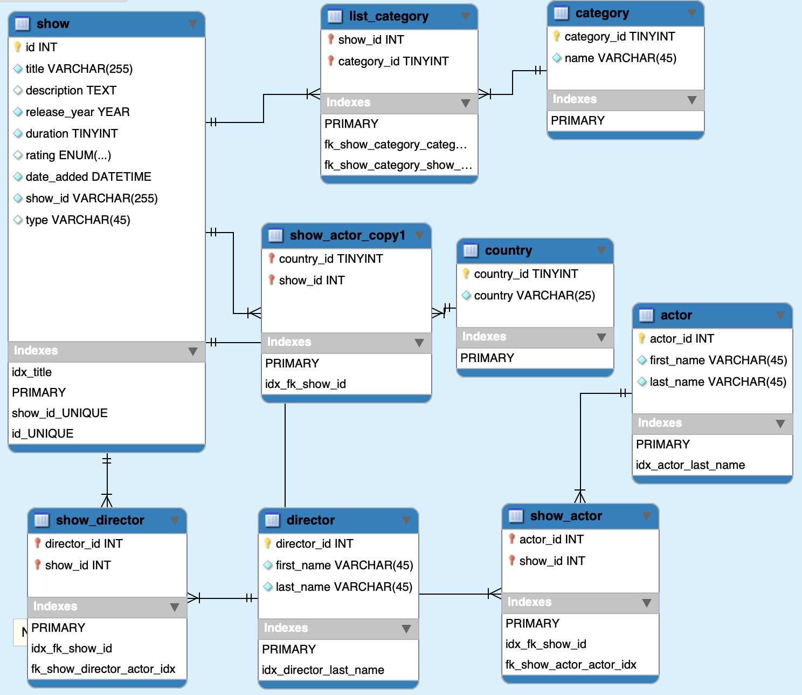

# Build Database for Netflix Tittles

- This repo would build a database and ETL data from a dataset into it. And also give some description for the data. 

# Requirements

- Python 3
- SQLAlchemy 
- Pandas
- Requests 

# How to use

Print parameters:

```bash
python main.py --help
```

```
usage: main.py [-h] [-f FILE] [-db DB_NAME] [-q QUERY] [-g] [-c CONFIG]

optional arguments:
  -h, --help            show this help message and exit
  -f FILE, --file FILE  file address for input data
  -db DB_NAME, --db_name DB_NAME
                        name of database
  -q QUERY, --query QUERY
                        file for query to create tables
  -g, --gender          enhance gender
  -c CONFIG, --config CONFIG
                        config file for db connection
```
Run:
```
python main.py -f netflix_titles.csv -db netflix_db -q create_table.sql -g
```
- netflix_titles.csv : netflix show data
- netflix_db : db name I set
- create_table.sql : db schema
- enhance gender or not.
- default config file is config.json (set my own laptop config)


# Project description
## Data

| **Column** | **Value** | **Description** |
| --- | --- | --- |
| show\_id | String | Unique ID for every Movie / Tv Show |
| type | String | Identifier - A Movie or TV Show |
| Title | String | Title of the Movie / Tv Show |
| Director | String | Director of the Movie |
| Cast | String | Actors involved in the movie / show |
| Country | String | Country where the movie / show was produced |
| Date\_added | Date | Date it was added on Netflix |
| Release\_year | Integer | Actual Release year of the move / show |
| Rating | String | TV Rating of the movie / show |
| Duration | String | Total Duration - in minutes or number of seasons |
| Listed\_in | String | Genre |
| description | String | The summary description |

## Data modeling



## Files introduction
- *utilities package* contains the functions that used to create database and import data into the database.
- *config.json* is the db connection parameters in json format.
- *create_tables.sql* to create the tables to build the schema.
- *valid data.sql* are some sql query to check missing data.
- *questions.sql* answers questions about the dataset.
- *answer_questions.py* is a callable python script to show the answers.
```python answer_questions.py -db netflix_db```
- *get_gender.py* can enhance the data by adding the actors' gender (Male / Female). [https://www.aminer.cn/gender/api](https://www.aminer.cn/gender/api) 
And save the result into *gender.csv*.
```python get_gender.py --log_name request_gender --out_name gender.csv --input_name actors_for_gender.csv```
- *test package* for unittest.
- *miss_field_test.csv* is a test file to test input files which may miss some field or data.
```python main.py -f miss_field_test.csv -db test -q create_table.sql -g```


## Describe dataset
- 7 shows don't have rating
- 10 records don't have date_added
- all data have release_year, duration, type, description
- longest TV show has 16 season. id s2539, 'Grey's Anatomy'.
- longest Movie has 312 mins. id s958, 'Black Mirror: Bandersnatch'.
- Total 2410 TV Show and 5377 Movies.
- The ration TV-MA is the most, and then TV-14 
- 719 shows don't have cast
- 2390 shows don't have director
- 56 shows don't have category
- 507 shows don't have country
- 31 records' date_added smaller than release year (Strange)

## Answer questions
Can call by command ```python answer_questions.py -db netflix_db```
Then it will ask which one of fallowing you want to know and give back the result.

- What is the most common first name among actors and actresses?
```
 Michael for all gender 263
 David for actors 113
 Michael for actresses 86
```
- Which Movie had the longest timespan from release to appearing on Netflix?
```
 93 years. 
 id s4868, 'Pioneers: First Women Filmmakers*'.
```
- Which Month of the year had the most new releases historically?
```
 For spesific month in spesific year:
 Nov, 2019.  272 shows.
 For months during all time period.
 Dec.  833 shows.
```
- Which year had the largest increase year on year (percentage wise) for TV Shows?
```
 2016 over 2015 increase 516.7% 
```
- List the actresses that have appeared in a movie with Woody Harrelson more than once.
```commandline
 16 actresses
'Bill Murray' 'Casey Affleck' 'Clifton Collins Jr.' 'Derek Graf' 'Donald Glover' 'January Jones' 'John Carroll Lynch' 'Jonathan Loughran' 'José Zúñiga' 'Kim Dickens' 'Marisa Tomei' 'Norman Reedus' 'Paul Bettany' 'Randy Quaid' 'Richard Tyson' 'Robinne Lee' 
```
